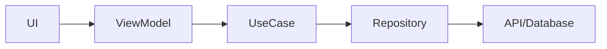
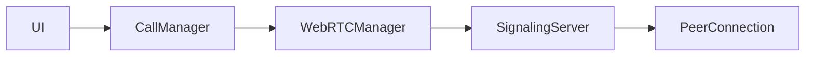

# Architecture Documentation

## Overview
The CCC Healthcare Communication Platform follows a modern, scalable architecture designed for security, reliability, and HIPAA compliance.

## Architecture Layers

### 1. Presentation Layer (UI)
```swift
// MVVM Pattern
struct MessageView: View {
    @StateObject private var viewModel: MessageViewModel
    @Environment(\.scenePhase) private var scenePhase
    
    var body: some View {
        contentView
            .onChange(of: scenePhase) { phase in
                viewModel.handleScenePhaseChange(phase)
            }
    }
}

final class MessageViewModel: ObservableObject {
    @Published private(set) var messages: [Message] = []
    @Published private(set) var isLoading = false
    
    private let messageManager: MessageManager
    private let securityManager: SecurityManager
    
    func sendMessage(_ content: String) async throws {
        let encrypted = try securityManager.encryptMessage(content)
        try await messageManager.send(encrypted)
    }
}
```

### 2. Domain Layer (Business Logic)
```swift
// Use Cases
final class SendMessageUseCase {
    private let messageManager: MessageManager
    private let securityManager: SecurityManager
    private let validationManager: ValidationManager
    
    func execute(
        content: String,
        recipient: User
    ) async throws -> Message {
        // 1. Validate input
        try validationManager.validateMessage(content)
        
        // 2. Encrypt message
        let encrypted = try securityManager.encryptMessage(content)
        
        // 3. Send message
        return try await messageManager.send(
            encrypted,
            to: recipient
        )
    }
}

// Domain Models
struct Message: Identifiable, Codable {
    let id: UUID
    let senderId: UUID
    let recipientId: UUID
    let content: String
    let timestamp: Date
    var status: MessageStatus
    var attachments: [Attachment]
}
```

### 3. Data Layer
```swift
// Repositories
protocol MessageRepository {
    func fetchMessages() async throws -> [Message]
    func saveMessage(_ message: Message) async throws
    func deleteMessage(_ id: UUID) async throws
}

final class MessageRepositoryImpl: MessageRepository {
    private let database: Database
    private let apiClient: APIClient
    private let encryptionManager: EncryptionManager
    
    func fetchMessages() async throws -> [Message] {
        // 1. Fetch from local database
        let cached = try await database.fetch(Message.self)
        
        // 2. Fetch from API
        let remote = try await apiClient.fetchMessages()
        
        // 3. Merge and decrypt
        return try await mergeAndDecrypt(cached, remote)
    }
}
```

### 4. Infrastructure Layer
```swift
// Networking
final class APIClient {
    private let session: URLSession
    private let baseURL: URL
    
    func request<T: Decodable>(
        _ endpoint: Endpoint,
        method: HTTPMethod = .get
    ) async throws -> T {
        let request = try buildRequest(endpoint, method: method)
        let (data, response) = try await session.data(for: request)
        try validateResponse(response)
        return try decode(T.self, from: data)
    }
}

// Database
final class Database {
    private let container: ModelContainer
    
    func save<T: PersistentModel>(_ object: T) throws {
        try container.mainContext.save()
    }
    
    func fetch<T: PersistentModel>(_ type: T.Type) throws -> [T] {
        try container.mainContext.fetch(T.self)
    }
}
```

## Core Components

### 1. Security Layer
```swift
final class SecurityManager {
    private let keyManager: KeyManager
    private let encryptionManager: EncryptionManager
    private let authManager: AuthManager
    
    func secureData(_ data: Data) throws -> SecureData {
        // 1. Get encryption key
        let key = try keyManager.getCurrentKey()
        
        // 2. Encrypt data
        let encrypted = try encryptionManager.encrypt(data, using: key)
        
        // 3. Add security metadata
        return SecureData(
            encrypted: encrypted,
            metadata: SecurityMetadata(
                timestamp: Date(),
                keyId: key.id,
                algorithm: .AES256GCM
            )
        )
    }
}
```

### 2. Communication Layer
```swift
final class CommunicationManager {
    private let webSocketManager: WebSocketManager
    private let pushNotificationManager: PushNotificationManager
    private let callManager: CallManager
    
    func setupRealTimeCommunication() async throws {
        // 1. Connect WebSocket
        try await webSocketManager.connect()
        
        // 2. Configure push notifications
        try await pushNotificationManager.configure()
        
        // 3. Initialize call manager
        try await callManager.initialize()
    }
}
```

### 3. Storage Layer
```swift
final class StorageManager {
    private let fileManager: FileManager
    private let securityManager: SecurityManager
    
    func securelyStoreFile(
        _ fileURL: URL,
        metadata: FileMetadata
    ) async throws -> SecureFileReference {
        // 1. Read file
        let data = try Data(contentsOf: fileURL)
        
        // 2. Encrypt data
        let encrypted = try securityManager.encryptFile(data)
        
        // 3. Store encrypted file
        let secureURL = try await storeEncryptedFile(encrypted)
        
        // 4. Create and return reference
        return SecureFileReference(
            id: UUID(),
            url: secureURL,
            metadata: metadata
        )
    }
}
```

## Data Flow

### 1. Message Flow


### 2. Call Flow


## Security Architecture

### 1. Authentication Flow
```swift
final class AuthenticationFlow {
    func authenticate() async throws -> AuthToken {
        // 1. Biometric authentication
        try await biometricAuth.authenticate()
        
        // 2. Token validation
        let token = try await tokenManager.validateToken()
        
        // 3. Session setup
        try await sessionManager.setupSession(token)
        
        return token
    }
}
```

### 2. Encryption Flow
```swift
final class EncryptionFlow {
    func encryptMessage(_ message: Message) throws -> EncryptedMessage {
        // 1. Generate message key
        let messageKey = try keyManager.generateMessageKey()
        
        // 2. Encrypt content
        let encryptedContent = try encrypt(
            message.content,
            with: messageKey
        )
        
        // 3. Encrypt key for recipient
        let encryptedKey = try encryptKeyForRecipient(
            messageKey,
            recipientId: message.recipientId
        )
        
        return EncryptedMessage(
            content: encryptedContent,
            key: encryptedKey
        )
    }
}
```

## Performance Considerations

### 1. Caching Strategy
```swift
final class CacheManager {
    private let memoryCache = NSCache<NSString, AnyObject>()
    private let diskCache: DiskCache
    
    func cachedValue<T>(
        for key: String,
        maxAge: TimeInterval = 3600
    ) throws -> T? {
        // Check memory cache
        if let value = memoryCache.object(forKey: key as NSString) as? T {
            return value
        }
        
        // Check disk cache
        return try diskCache.value(for: key, maxAge: maxAge)
    }
}
```

### 2. Background Processing
```swift
final class BackgroundTaskManager {
    func scheduleBackgroundTask(
        identifier: String,
        interval: TimeInterval
    ) {
        BGTaskScheduler.shared.register(
            forTaskWithIdentifier: identifier,
            using: nil
        ) { task in
            self.handleBackgroundTask(task)
        }
    }
    
    private func handleBackgroundTask(_ task: BGTask) {
        // Implementation
    }
}
```

## Error Handling

### 1. Error Types
```swift
enum AppError: LocalizedError {
    case network(NetworkError)
    case security(SecurityError)
    case storage(StorageError)
    case validation(ValidationError)
    
    var errorDescription: String? {
        switch self {
        case .network(let error):
            return "Network error: \(error.localizedDescription)"
        case .security(let error):
            return "Security error: \(error.localizedDescription)"
        case .storage(let error):
            return "Storage error: \(error.localizedDescription)"
        case .validation(let error):
            return "Validation error: \(error.localizedDescription)"
        }
    }
}
```

### 2. Error Recovery
```swift
final class ErrorRecoveryManager {
    func attemptRecovery(from error: Error) async throws {
        switch error {
        case let networkError as NetworkError:
            try await recoverFromNetworkError(networkError)
        case let securityError as SecurityError:
            try await recoverFromSecurityError(securityError)
        default:
            throw error
        }
    }
}
``` [Previous content remains the same...]

## Dependency Injection

### 1. Service Container
```swift
final class ServiceContainer {
    static let shared = ServiceContainer()
    
    private var services: [String: Any] = [:]
    
    func register<T>(_ type: T.Type, instance: T) {
        services[String(describing: type)] = instance
    }
    
    func resolve<T>() -> T? {
        services[String(describing: T.self)] as? T
    }
}

// Usage
@propertyWrapper
struct Inject<T> {
    var wrappedValue: T
    
    init() {
        guard let value: T = ServiceContainer.shared.resolve() else {
            fatalError("No instance for type \(T.self) registered!")
        }
        wrappedValue = value
    }
}
```

### 2. Module Dependencies
```swift
final class ModuleDependencies {
    // Core Services
    let securityManager: SecurityManager
    let networkManager: NetworkManager
    let storageManager: StorageManager
    
    // Feature Services
    let messageService: MessageService
    let callService: CallService
    let emergencyService: EmergencyService
    
    // Utilities
    let analyticsManager: AnalyticsManager
    let logManager: LogManager
    
    static func configure() {
        let container = ServiceContainer.shared
        
        // Register core services
        container.register(SecurityManager.self, instance: SecurityManager())
        container.register(NetworkManager.self, instance: NetworkManager())
        
        // Register feature services
        container.register(MessageService.self, instance: MessageService())
        container.register(CallService.self, instance: CallService())
    }
}
```

## Event Handling

### 1. Event Bus
```swift
final class EventBus {
    static let shared = EventBus()
    
    private var handlers: [String: [(Any) -> Void]] = [:]
    
    func subscribe<T>(_ type: T.Type, handler: @escaping (T) -> Void) {
        let key = String(describing: type)
        handlers[key, default: []].append { event in
            guard let event = event as? T else { return }
            handler(event)
        }
    }
    
    func publish<T>(_ event: T) {
        let key = String(describing: T.self)
        handlers[key]?.forEach { $0(event) }
    }
}

// Usage
struct MessageReceivedEvent {
    let message: Message
}

// Subscribe
EventBus.shared.subscribe(MessageReceivedEvent.self) { event in
    // Handle message received
}

// Publish
EventBus.shared.publish(MessageReceivedEvent(message: message))
```

### 2. State Management
```swift
final class AppState: ObservableObject {
    @Published private(set) var authState: AuthState
    @Published private(set) var messageState: MessageState
    @Published private(set) var callState: CallState
    
    private var cancellables: Set<AnyCancellable> = []
    
    init() {
        setupStateObservers()
    }
    
    private func setupStateObservers() {
        // Observe auth changes
        $authState
            .sink { [weak self] state in
                self?.handleAuthStateChange(state)
            }
            .store(in: &cancellables)
        
        // Observe message changes
        $messageState
            .sink { [weak self] state in
                self?.handleMessageStateChange(state)
            }
            .store(in: &cancellables)
    }
}
```

## Module Architecture

### 1. Feature Modules
```swift
protocol FeatureModule {
    var router: Router { get }
    var dependencies: ModuleDependencies { get }
    
    func initialize()
    func cleanup()
}

final class MessagingModule: FeatureModule {
    let router: Router
    let dependencies: ModuleDependencies
    
    private let viewModel: MessagingViewModel
    
    init(router: Router, dependencies: ModuleDependencies) {
        self.router = router
        self.dependencies = dependencies
        self.viewModel = MessagingViewModel(dependencies: dependencies)
    }
    
    func initialize() {
        setupRoutes()
        setupObservers()
    }
}
```

### 2. Module Routing
```swift
final class Router {
    private var routes: [String: () -> AnyView] = [:]
    
    func register(_ path: String, view: @escaping () -> AnyView) {
        routes[path] = view
    }
    
    func view(for path: String) -> AnyView? {
        routes[path]?()
    }
}

// Usage
router.register("/messages") {
    AnyView(MessagesView())
}
```

## Persistence Layer

### 1. Database Schema
```swift
extension ModelSchema {
    static var v1: ModelSchema {
        ModelSchema(
            entities: [
                User.schema,
                Message.schema,
                Call.schema,
                Emergency.schema
            ],
            version: ModelVersion("1.0.0")
        )
    }
}

extension User {
    static var schema: ModelSchema {
        ModelSchema(
            name: "User",
            properties: [
                .field("id", .uuid, .required),
                .field("firstName", .string, .required),
                .field("lastName", .string, .required),
                .field("role", .int16, .required),
                .relationship("messages", .toMany, "Message", "sender")
            ]
        )
    }
}
```

### 2. Migration Manager
```swift
final class MigrationManager {
    func performMigrations() async throws {
        let currentVersion = try await getCurrentVersion()
        let migrations = getMigrations(from: currentVersion)
        
        for migration in migrations {
            try await perform(migration)
        }
    }
    
    private func perform(_ migration: Migration) async throws {
        // Begin transaction
        try await database.beginTransaction()
        
        do {
            // Execute migration
            try await migration.execute()
            
            // Update schema version
            try await updateSchemaVersion(to: migration.version)
            
            // Commit transaction
            try await database.commitTransaction()
        } catch {
            // Rollback on error
            try await database.rollbackTransaction()
            throw error
        }
    }
}
```

## Analytics & Monitoring

### 1. Analytics Tracking
```swift
final class AnalyticsManager {
    private let securityManager: SecurityManager
    
    func trackEvent(_ event: AnalyticsEvent) {
        // Sanitize sensitive data
        let sanitizedEvent = sanitizeEvent(event)
        
        // Track event
        analytics.track(
            name: sanitizedEvent.name,
            properties: sanitizedEvent.properties
        )
    }
    
    private func sanitizeEvent(_ event: AnalyticsEvent) -> AnalyticsEvent {
        // Remove PII and sensitive data
        var properties = event.properties
        properties.removeValue(forKey: "patientId")
        properties.removeValue(forKey: "medicalData")
        return AnalyticsEvent(
            name: event.name,
            properties: properties
        )
    }
}
```

### 2. Performance Monitoring
```swift
final class PerformanceMonitor {
    private var metrics: [String: [TimeInterval]] = [:]
    
    func startMeasuring(_ event: String) -> PerformanceToken {
        let token = PerformanceToken(name: event, startTime: Date())
        return token
    }
    
    func stopMeasuring(_ token: PerformanceToken) {
        let duration = Date().timeIntervalSince(token.startTime)
        metrics[token.name, default: []].append(duration)
        
        if shouldReport(token.name) {
            reportMetrics(for: token.name)
        }
    }
    
    private func reportMetrics(for event: String) {
        guard let measurements = metrics[event] else { return }
        
        let average = measurements.reduce(0, +) / Double(measurements.count)
        let max = measurements.max() ?? 0
        let min = measurements.min() ?? 0
        
        analytics.trackMetric(
            name: "performance.\(event)",
            values: [
                "average": average,
                "max": max,
                "min": min
            ]
        )
    }
}
```
